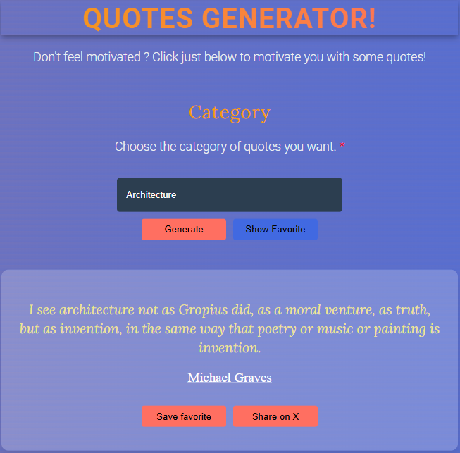

# Quotes Generator
This is a basic quotes generator entirely coded in Javascript, HTML and CSS.

## Goal
Work a bit on Javascript, HTML and CSS to use time between lessons (I had a f***ing break of 5h between class on 5th 
december lol)

## How did I complete it ?
I had to use a great IDE named Notepad++ (If you know, you know...) and a magnificent computer equipped 
with only 1 screen (1280x720), a shit keyboard (the space bar is barely working) and only 4gb of ram on Windows 10 !!
Maybe that's all the reason why I did took 2hrs and 30mn to write everything.

## Use of AI ?
Obviously not, the goal was to practice and not to ask ChatGPT to do it in 30s

## N.B.
If you liked the project it's still nice to star the repo, and feel free to rob my code for you own project.

## Sources
- [Stack Overflow]('https://stackoverflow.com/') Obviously
- [API Ninjas]('https://api-ninjas.com) to get the quotes
- Knowledge lol

## Result ?
[Click this link](https://didoub74-off.github.io/QuotesGenerator/)

